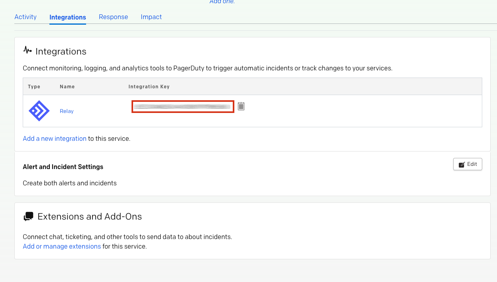
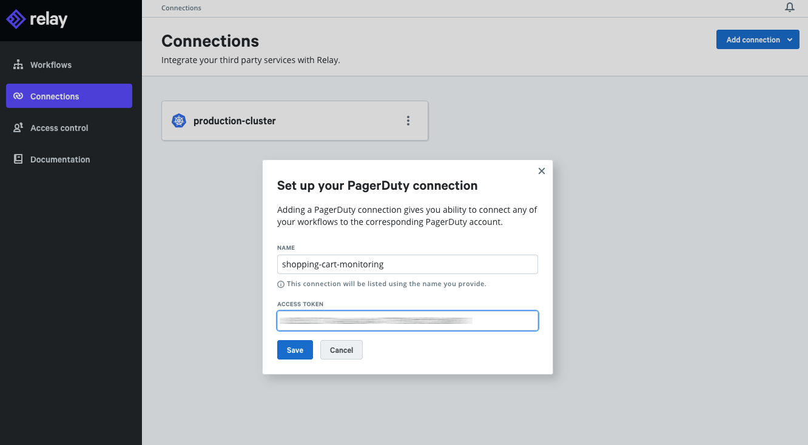
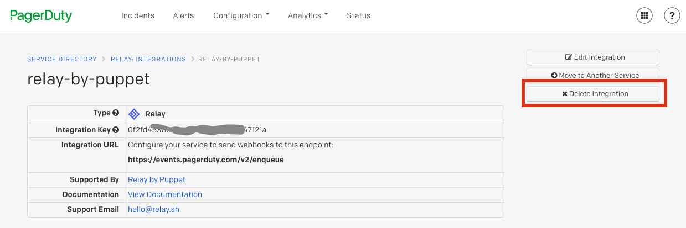
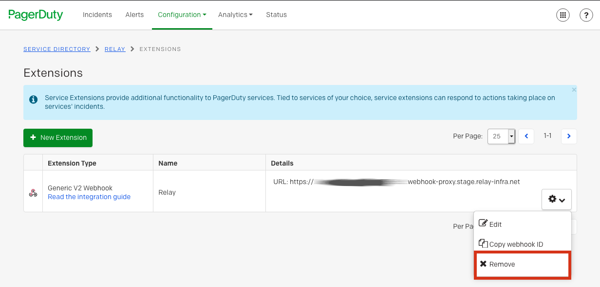

# PagerDuty + Relay Integration Benefits
    
* Respond to PagerDuty incidents with Relay's event-driven workflow engine.
* Track details of triggered events in ticketing systems such as Jira. 
* Submit incident acknowledgements and changes from external sources such as Slack.
* Codify and automate incident response process saving valuable time and resources.
* Centralize audit trails of actions taken when responding to a production incident.

# How it Works
* Incidents from PagerDuty can trigger Relay workflow runs to automatically address infrastructure needs and coordinate staff responses using the catalog of Relay providers. Whether restarting ec2 instances, logging incident details in Jira, setting up war rooms in Slack, or gathering status information from Kubernetes, Relay has you covered.
* Relay workflow failures can be submitted to PagerDuty to trigger incidents as well, reducing response time to failed deployments or upgrades.
* PagerDuty incidents may be acknowledged and resolved using the Relay PagerDuty integration as part of a workflow run.
* Similarly, PagerDuty change events detailing actions taken to address the incident may also be logged in PagerDuty by Relay workflow runs.
 

# Requirements
* PagerDuty Relay [step integrations](https://github.com/relay-integrations/relay-pagerduty/tree/master/steps) require permissions sufficient for managing **Service Integrations** on an existing service. See [PagerDuty's documentation](https://support.pagerduty.com/docs/services-and-integrations) for details. If you do not have this role, please reach out to an Admin or Account Owner within your organization to configure the integration.
* PagerDuty Relay [trigger integrations](https://github.com/relay-integrations/relay-pagerduty/tree/master/triggers) require permissions sufficient for managing **Extensions and Add-ons** on an existing service. See [PagerDuty's documentation](https://support.pagerduty.com/docs/extensions-add-ons) for details. If you do not have this role, please reach out to an Admin or Account Owner within your organization to configure the integration.

# Support

If you need help with this integration, please contact Relay Support at [hello@relay.sh](mailto:hello@relay.sh). 

# Integration Walkthrough

There are two ways to integrate with PagerDuty: via Global Event Routing or on a PagerDuty Service. If you are adding this integration to an existing PagerDuty service, please skip to the Integrating with a PagerDuty Service section of this guide.
There are two kinds of Relay integrations that can be added to a PagerDuty Service:
- One Relay integration is the [PagerDuty Trigger](https://github.com/relay-integrations/relay-pagerduty/tree/master/triggers) and may be added by following the [Integrating Relay Triggers With a PagerDuty Service](#integrating-relay-triggers-with-a-pagerduty-service) section of this guide.
- The other Relay integration is the [PagerDuty Steps](https://github.com/relay-integrations/relay-pagerduty/tree/master/steps) and may be added by following the [Integrating Relay Steps With a PagerDuty Service](#integrating-relay-steps-with-a-pagerduty-service) section of this guide.

## In PagerDuty

### Integrating Relay Steps With a PagerDuty Service
1. From the **Configuration** menu, select **Services**.
2. There are two ways to add an integration to a service:
   * **If you are adding your integration to an existing service**: Click the **name** of the service you want to add the integration to. Then, select the **Integrations** tab and click the **New Integration** button.
   * **If you are creating a new service for your integration**: Please read PagerDuty's documentation in section [Services and Integrations](https://support.pagerduty.com/docs/services-and-integrations) and follow the steps outlined in the [Create a New Service](https://support.pagerduty.com/docs/services-and-integrations#section-create-a-new-service) section, selecting Relay as the **Integration Type** in step 4. Continue with the [In  Relay](#in-relay)  section (below) once you have finished these steps.
3. Enter an **Integration Name** such as `Relay` or `relay-by-puppet` and select Relay from the Integration Type menu.
4. Click the **Add Integration** button to save your new integration. You will be redirected to the Integrations tab for your service.
5. An **Integration Key** will be generated on this screen. Keep this key saved in a safe place, as it will be used when you configure the integration with Relay in the next section.
6. Continue with the [In Relay](#in-relay) section below.

### Integrating Relay Triggers With a PagerDuty Service
1. From the **Configuration** menu, select **Services**.
3. Using your Relay Workflow webhook url, follow the official [PagerDuty documentation for adding a webhook](https://support.pagerduty.com/docs/webhooks)

## In Relay

### Adding a Relay Connection for PagerDuty Steps
Connections allow you to link Relay steps to other services you use, suchs as PagerDuty.

1. Navigate to your [Relay Connections Page](https://app.relay.sh/connections) and click "Add Connection" in the top-right corner. Find PagerDuty in the list and click it.
2. Fill in an appropriate connection name in the Name field, such as `shopping-cart-monitoring`
3. Paste the PagerDuty integration key obtained from the previous section [Integrating Relay Steps With a PagerDuty Service](#integrating-relay-steps-with-a-pagerduty-service) and click Save.

# How to Uninstall
A PagerDuty user can remove a Relay integration from a PagerDuty Service via the PagerDuty Service's Integrations tab.

### Uninstall the Relay Step Integration
1. Locate the desired Relay Step Integration on the PagerDuty Service Integrations tab and click on the integration name.
2. Next, click the "Delete Integration" button on the right side of the page.

### Uninstall the Relay Trigger Integration
1. Locate the Extensions and Add-Ons section of the PagerDuty Integrations tab and click on the "Add or manage extensions" link.
2. Next, locate the desired Relay Trigger webhook to delete and click its settings down arrow, then click the Remove button.

